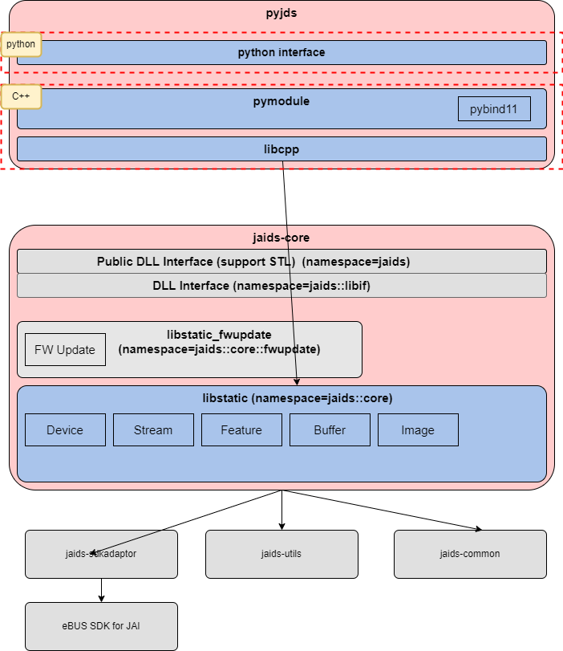

# 設計資料

pyjdsはiaids-coreのPythonバインディングでありpythonで実装されたインタフェースレイヤーとC++で実装された`pymodule`,`libcpp`から構成される。python interfaceはpythonで実装されたpublic interfaceでありユーザはpython interfaceのクラスを利用してアプリの実装を行う。`pymodule`はC++のコードを[pybind11](https://github.com/pybind/pybind11)を利用してbindingするモジュールであり`*.pyd`形式のファイルとしてリリースされる。pydという拡張子であるが実態はDLLファイルと同一である。




## folder構成

```
    Directory: C:\work\10.development\pyJds

Mode                 LastWriteTime         Length Name
----                 -------------         ------ ----
d----          2022/01/21    10:38                .github
d----          2022/01/06     9:38                .vs
d----          2022/05/17    10:51                docs
d----          2022/02/14    20:20                python
d----          2022/05/17    10:45                src
d----          2022/03/07    14:28                test
```

| folder |                                         |
| ------ | --------------------------------------- |
| docs   | 設計ドキュメントを格納                  |
| python | public interface                        |
| src    | c++ source code                         |
| test   | google testを利用したc++実装のtest code |

### python folder

```
Mode                 LastWriteTime         Length Name
----                 -------------         ------ ----
d----          2022/01/26    11:03                .pytest_cache
d----          2022/03/07    16:30                api-docs
d----          2022/05/17    10:48                src
d----          2022/05/01    16:13                test
d----          2022/03/02    15:35                tools
```

| folder   |                                                             |
| -------- | ----------------------------------------------------------- |
| api-docs | 公開Intaerface document生成用ファイル、詳細は別途記載       |
| src      | public interface                                            |
| test     | pytestを利用したtest code, GS/PM向けSample codeを兼ねている |
| tools    | Debug用途のUtility,リリースはしない                         |

### src folder

src folderはC++の実装をpython bindingするコード群でありpyjdsのコアとなるモジュールである。`libcpp`にはpython bindingの機能は実装していない。binding用の`pymodule`から利用されるstatic libraryである。`libcpp`,`pymodule`と実装を分ける事でDebugをやりやすくする事が目的である。bindingには`pybind11`を利用しているが`pybind11`をlinkするとGoogle TestでTestが実行できなかった。その対応としてモジュールを分割している。

```
Mode                 LastWriteTime         Length Name
----                 -------------         ------ ----
d----          2022/05/17    10:45                libcpp
d----          2022/05/17    10:45                pymodule
```

## How to build

srcフォルダ以下のC++モジュールについてはbuildが必要であり、build成功すると*.pyd形式のfileが生成される。buildはCMakeを利用して行う。jaids-coreなど依存しているlibraryもbuild時にダウンロード、Link設定を自動で行う。

:exclamation:linkに必要な依存モジュールはhttps://github.com/jai-rd/pyJds/blob/develop/src/CMakeLists.txtに記述している。現状社内評価中であり全てdevelop branchを利用しているが、リリース時にはTAGを使って依存モジュールのfixが必要。

具体的なbuild手順は[こちら](./create_whl.md)を参照

### pymodule

基本的にはpythonからAPI実行された場合pymoduleは対応するjaids-coreのメソッドを実行するという流れであり、一部例外を除きpymoduleで特別な事は行っていない。一部例外とはRAW画像の取得が該当する。

pythonでは画像データはnumpyのndarrayを利用する事が一般的であり、pyjdsでもRAW画像はndarray形式である。カメラから取得したRAW画像をndarrayに変換する処理をpymoduleで実装している。

https://github.com/jai-rd/pyJds/blob/eac394703be2220c0782c04d2fa70323f2f2b188/src/pymodule/module.cpp#L72-L94

##　要求仕様

PM, GS作成の下記Software Requirement Specificationのうち、Prioryty=0の物を基本的に対応している

https://jaionline.sharepoint.com/:w:/s/JAIDeveloperSuiteVer2/EQEOHLB2GO9HjY4R5i-mqOMBIy25MsVkTe8zjtulpADyrA?e=eRhO0y

実装状況詳細は[additional_explanation_of_SRS_support_status.md](additional_explanation_of_SRS_support_status.md)に記載

### support python

当初要求仕様ではPython3.7対応があったがPython3.7はEOLが近いので未対応とした。[Python EOL](https://github.com/jai-rd/pyJds/issues/1)


## Relaese

pyjdsのリリースはinterfaceであるPythonコードおよびpydファイルをパッケージしたwhlファイルのリリースを行う。詳細は[whlファイルの作成](create_whl.md)を参照の事

### Testコード

`python/test`以下にpytestを利用したtestコードが存在する。これは社内GS向けのSampleCodeとして利用していると共に、リリース時に動作確認用に利用している。pipのdevelopモードを利用する事でwhlファイルをインストールせずに実行可能となる。[developモードでDebugする方法](debug_py.md)


## APIドキュメント作成

ユーザ向けのAPIドキュメントはSphinxを使って生成する。[作成手順](sphinx.md)

